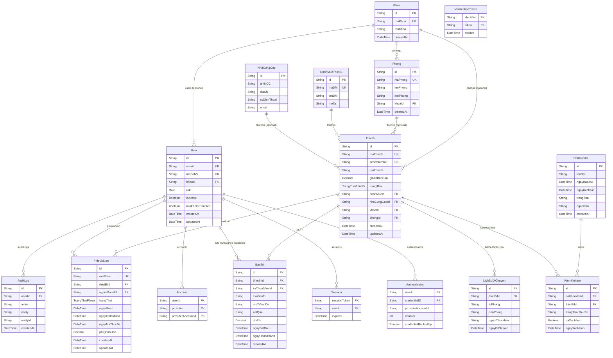

# ERD (Entity Relationship Diagram)

> Nguồn: `prisma/schema.prisma`

## Ghi chú

- Các enum chính: `Role`, `TrangThaiThietBi`, `TrangThaiPhieu`.
- `Account`, `Session`, `VerificationToken`, `Authenticator` là các bảng phục vụ Auth.js/NextAuth (Prisma Adapter).

